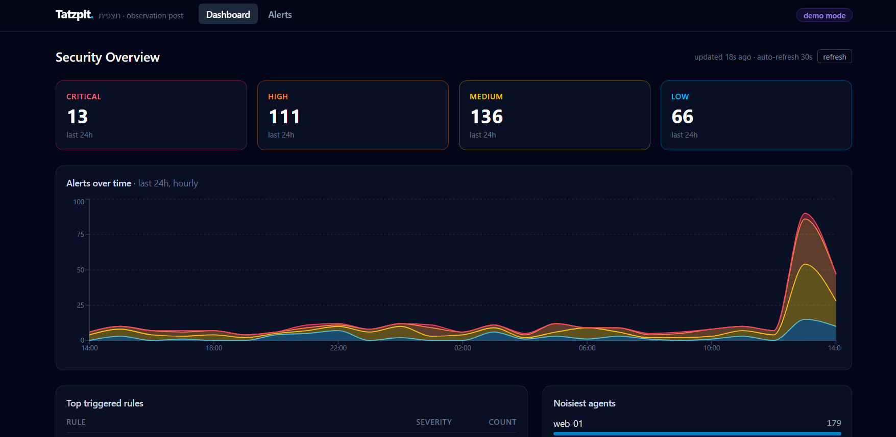
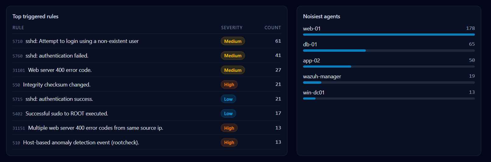
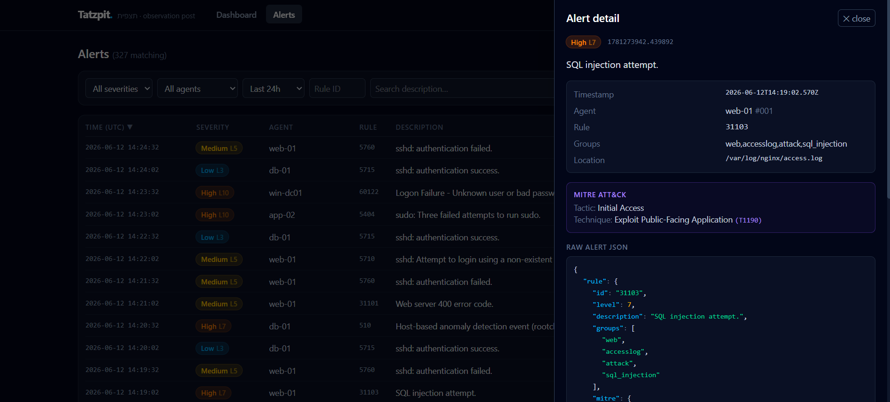

# Tatzpit 🔭

**A personal mini-SIEM dashboard for Wazuh alerts.**

*Tatzpit* (תצפית) is Hebrew for **"observation post"** — a vantage point you watch your terrain from. This project is exactly that for a homelab: it pulls security alerts from a Wazuh manager, normalizes them into SQLite, and presents them in a clean, dark-themed SOC dashboard with severity breakdowns, MITRE ATT&CK context, and live auto-refresh.

> Built as a portfolio project for SOC analyst / security automation work: small enough to read in an evening, real enough to run against a live Wazuh deployment.

## Screenshots

**Dashboard** — severity cards and the 24h stacked alert timeline (note the brute-force spike):



**Top triggered rules & noisiest agents:**



**Alerts explorer** — detail drawer with MITRE ATT&CK mapping and raw JSON viewer:



## Architecture

```
                        ┌─────────────────────────── Tatzpit ───────────────────────────┐
                        │                                                               │
┌────────────────┐      │   ┌──────────────────────────┐        ┌────────────────────┐  │
│  Wazuh Manager │      │   │   FastAPI backend        │        │  React frontend    │  │
│  (Ubuntu, LAN) │      │   │                          │        │  (Vite + Tailwind) │  │
│                │      │   │  ┌────────────────────┐  │  REST  │                    │  │
│  Wazuh Indexer ├──────┼──►│  │ Poller (30s cycle) │  │◄───────┤  Dashboard         │  │
│  :9200 (HTTPS) │ [1]  │   │  │  demo / indexer /  │  │  /api  │  Alerts + filters  │  │
│                │      │   │  │  ssh               │  │        │  Raw JSON viewer   │  │
│  alerts.json   ├──────┼──►│  └─────────┬──────────┘  │        └────────────────────┘  │
│  (via SSH)     │ [2]  │   │            ▼             │                                │
└────────────────┘      │   │  normalize → severity    │                                │
                        │   │  map → MITRE extract     │                                │
                        │   │            ▼             │                                │
                        │   │  ┌────────────────────┐  │                                │
                        │   │  │  SQLite (alerts)   │  │                                │
                        │   │  └────────────────────┘  │                                │
                        │   └──────────────────────────┘                                │
                        └───────────────────────────────────────────────────────────────┘
```

**[1] Why the Indexer and not the manager API?** A common surprise: the Wazuh manager's REST API (port 55000) manages agents, rules and configuration — it does **not** serve alerts. Alerts are shipped by Filebeat to the **Wazuh Indexer** (OpenSearch, port 9200) into `wazuh-alerts-4.x-*`, which is what the official Wazuh dashboard queries too. Tatzpit's `indexer` mode does the same with a plain OpenSearch range query.

**[2] SSH fallback.** If you run a manager without the indexer, `ssh` mode tails `/var/ossec/logs/alerts/alerts.json` over SSH instead (each poll re-reads the last 500 lines; duplicates are dropped by alert ID).

## Features

- **Three alert sources** — `demo` (bundled fixture, zero setup), `indexer` (Wazuh Indexer / OpenSearch), `ssh` (tail alerts.json via paramiko)
- **Severity mapping** from Wazuh rule levels with color coding throughout the UI:

  | Wazuh level | Severity | Color |
  |---|---|---|
  | 12+ | Critical | 🔴 rose |
  | 7–11 | High | 🟠 orange |
  | 4–6 | Medium | 🟡 yellow |
  | 0–3 | Low | 🔵 sky |

- **Dashboard** — severity cards (click-through to filtered alerts), stacked alerts-over-time chart (hourly, 24h), top triggered rules, noisiest agents
- **Alerts explorer** — filter by severity / agent / rule ID / time range / free-text, sortable columns, pagination, and a detail drawer with MITRE ATT&CK tactic & technique plus a syntax-highlighted raw JSON viewer
- **Auto-refresh** every 30 s with a visible "updated Xs ago" indicator; in demo mode the poller injects a fresh alert each cycle so the refresh is actually visible
- **Deduplication** by Wazuh alert ID, so overlapping polls and restarts never double-count
- **Health endpoint** (`/api/stats/health`) surfaced in the UI as a demo/live badge with last-poll error tooltips

## Quick start (demo mode, no Wazuh needed)

```bash
# backend
cd backend
python -m venv .venv && .venv\Scripts\activate    # Windows
pip install -r requirements-dev.txt
uvicorn app.main:app --reload --port 8000

# frontend (second terminal)
cd frontend
npm install
npm run dev
```

Open **http://localhost:5173** — the dashboard seeds itself with ~200 realistic sample alerts (SSH brute force, web scans, FIM changes, Windows logon failures, …) spread over the last 24 hours.

### Docker

```bash
cp .env.example .env        # optional — defaults to demo mode
docker compose up --build
```

Open **http://localhost:8080**. The SQLite database persists in a named volume.

## Connecting to a real Wazuh

Copy `.env.example` to `.env` and pick a mode — credentials only ever live in `.env`, which is git-ignored.

**Indexer mode (preferred):**

```ini
TATZPIT_MODE=indexer
WAZUH_INDEXER_URL=https://<manager-ip>:9200
WAZUH_INDEXER_USER=admin
WAZUH_INDEXER_PASSWORD=<password>
WAZUH_VERIFY_SSL=false   # Wazuh ships self-signed certs by default
```

**SSH mode (no indexer required):**

```ini
TATZPIT_MODE=ssh
SSH_HOST=<manager-ip>
SSH_USER=wazuh-reader
SSH_KEY_PATH=C:\Users\you\.ssh\id_ed25519
```

> Create a dedicated low-privilege reader on the manager rather than reusing root:
> ```bash
> sudo adduser --disabled-password wazuh-reader
> sudo usermod -aG wazuh wazuh-reader   # group with read access to /var/ossec/logs
> ```

## API

| Endpoint | Description |
|---|---|
| `GET /api/alerts` | List alerts — filters: `severity`, `agent`, `rule_id`, `since`, `until`, `search`; plus `sort_by`, `order`, `limit`, `offset` |
| `GET /api/alerts/{id}` | Full alert detail including raw Wazuh JSON |
| `GET /api/stats/summary` | Totals and counts per severity |
| `GET /api/stats/timeline` | Hourly counts per severity (zero-filled buckets) |
| `GET /api/stats/top-rules` | Most-triggered rules |
| `GET /api/stats/top-agents` | Noisiest agents |
| `GET /api/stats/health` | Mode, stored count, last poll time/error |

Interactive docs at `http://localhost:8000/docs` (FastAPI's built-in Swagger UI).

## Tests

```bash
cd backend
pytest
```

Covers the severity boundary mapping, all REST endpoints (filters, sorting, pagination, 404s, validation errors), MITRE field extraction, and alert deduplication.

## Why I built this

I wanted a project that mirrors the daily reality of SOC work — triaging by severity, pivoting from a spike on a chart to the underlying events, reading raw alert JSON — while exercising the automation skills the role actually needs: API integration against real security tooling (including its quirks, like alerts living in the indexer rather than the manager API), data normalization, and shipping something a teammate could run with one command. The demo mode exists because a security dashboard you can't show anyone is just a config file.

## Project structure

```
tatzpit/
├── backend/
│   ├── app/
│   │   ├── main.py            # FastAPI app + background poll loop
│   │   ├── config.py          # pydantic-settings (.env)
│   │   ├── database.py        # SQLAlchemy / SQLite schema
│   │   ├── severity.py        # Wazuh level → severity bucket
│   │   ├── ingest.py          # normalize + dedupe raw alerts
│   │   ├── routers/           # /api/alerts, /api/stats
│   │   └── pollers/           # demo, indexer (OpenSearch), ssh (paramiko)
│   ├── fixtures/sample_alerts.json
│   └── tests/
├── frontend/
│   └── src/
│       ├── pages/             # Dashboard, Alerts
│       └── components/        # SeverityBadge, JsonViewer, LastUpdated
├── docker-compose.yml
└── .env.example
```

## Security notes

- Credentials are read exclusively from `.env` (git-ignored); the repo ships only `.env.example`.
- `WAZUH_VERIFY_SSL=false` is the pragmatic default for Wazuh's self-signed certs — turn it on if you deploy real ones.
- The SSH poller auto-accepts unknown host keys for homelab convenience; pin the manager's key in `known_hosts` for anything beyond that.
- Tatzpit itself has no authentication — it is meant for localhost / trusted LAN use, not internet exposure.

## License

MIT
